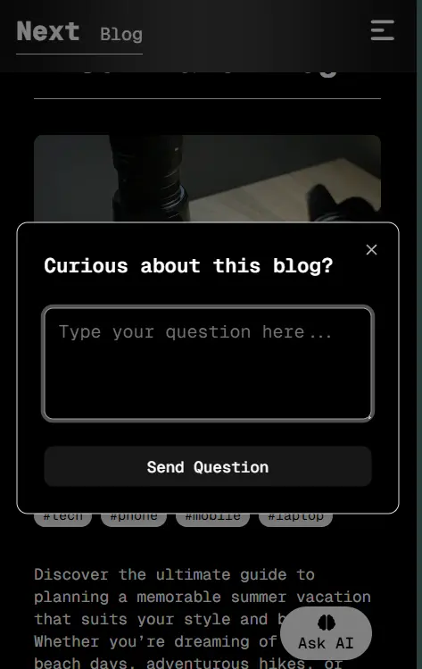
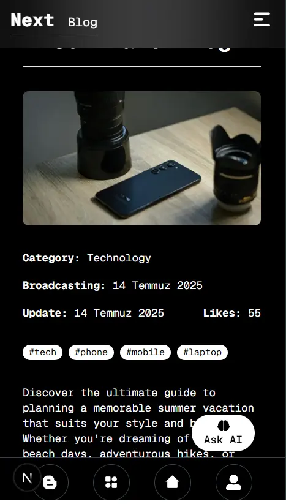
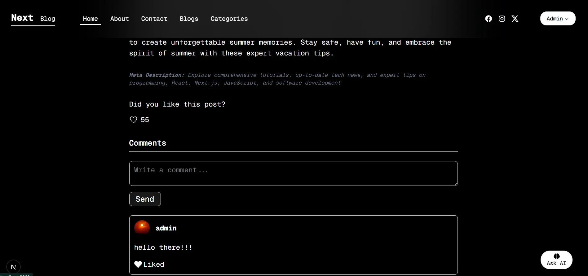
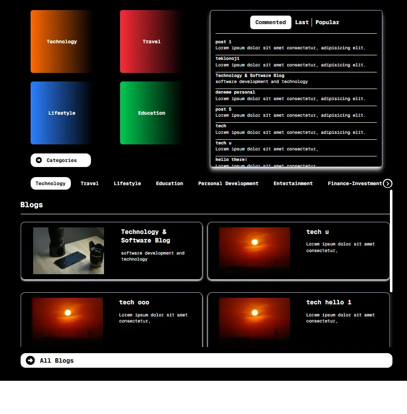
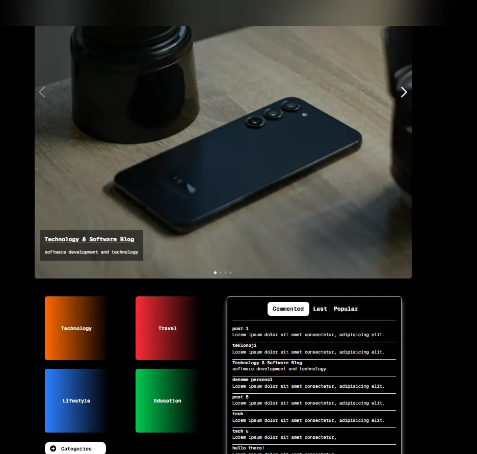
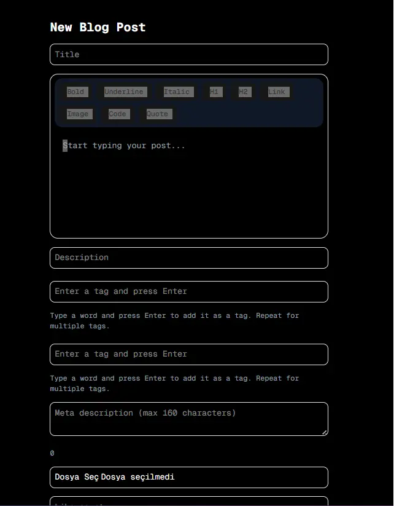

# 🧠 AI-Powered Blog Platform with Next.js 15

This is a modern, full-featured **AI-powered blog platform** built using **Next.js 15 (App Router)**, packed with rich features such as an AI chatbot for blog interaction, admin management, secure authentication, and much more.

## 🚀 Live Demo

🔗 _Deploy URL (optional)_  
🧑‍💻 [GitHub Repository](https://github.com/furkanarslan1/next_blog_app)

---

## ✨ Key Features

### 🧠 Smart AI Blog Assistant (powered by OpenAI v5)

- On each blog detail page, users can **ask questions about the blog content**.
- AI provides smart summaries, answers, and explanations.
- Powered by the **latest OpenAI SDK v5** for accurate and responsive answers.

### 🔐 Authentication

- JWT-based secure login and register system.
- Middleware protection for private pages.

### 📮 Contact Form

- Integrated with **Resend API** to send real emails.
- Uses **Zod + React Hook Form** for validation.
- **Google reCAPTCHA** included to prevent spam and abuse.

### 📚 Blog System

- Create, like, and comment on blog posts.
- Like and reply to comments.
- Related blogs based on category.
- Blog metadata: title, description, keywords, like count.
- Fully-featured **Tiptap Editor** including:
  - Bold, Underline, Italic
  - Headings (H1, H2)
  - Links, Code Blocks, Quotes
  - Image upload support
  - Placeholder and code syntax highlighting with `lowlight`

### 🛠️ Admin Panel

- Create, edit, and delete blog posts and categories.
- Assign post order in the homepage slider.
- Upload blog images with **Cloudinary**.
- Easy-to-use forms powered by **Zod** and **React Hook Form**.

---

## 🧰 Tech Stack

| Area             | Stack / Tool                                            |
| ---------------- | ------------------------------------------------------- |
| Framework        | [Next.js 15](https://nextjs.org) (App Router)           |
| Styling & UI     | TailwindCSS 4, Tailwind Typography, Shadcn, React Icons |
| State Management | Zustand                                                 |
| Editor           | Tiptap Editor with lowlight for syntax highlighting     |
| Backend          | Custom API Routes with JWT Auth                         |
| ORM & DB         | Prisma ORM + PostgreSQL                                 |
| Form Handling    | Zod + React Hook Form + @hookform/resolvers             |
| Mailing          | Resend API                                              |
| CAPTCHA          | Google reCAPTCHA                                        |
| AI Assistant     | OpenAI v5 SDK                                           |
| Image Upload     | Cloudinary via next-cloudinary                          |
| Slider           | Swiper.js                                               |

---








## 🧑‍💻 Getting Started

### 1. Clone the project

```bash
git clone https://github.com/furkanarslan1/next_blog_app.git
cd next_blog_app


  Install dependencies
  npm install


 Setup environment variables
Create a .env.local file and add the following:

DATABASE_URL=
JWT_SECRET=
RESEND_API_KEY=
OPENAI_API_KEY=
CLOUDINARY_CLOUD_NAME=
CLOUDINARY_API_KEY=
CLOUDINARY_API_SECRET=
RECAPTCHA_SECRET_KEY=


Run the development server

npm run dev

npm run dev         # Start development server
npm run build       # Build for production
npm run start       # Start production server
npm run lint        # Lint the codebase


🤝 Contributing

Pull requests are welcome. For major changes, please open an issue first to discuss what you would like to change.

 License
This project is licensed under the MIT License.


👨‍💻 Author
Furkan Arslan
🔗 GitHub
```
